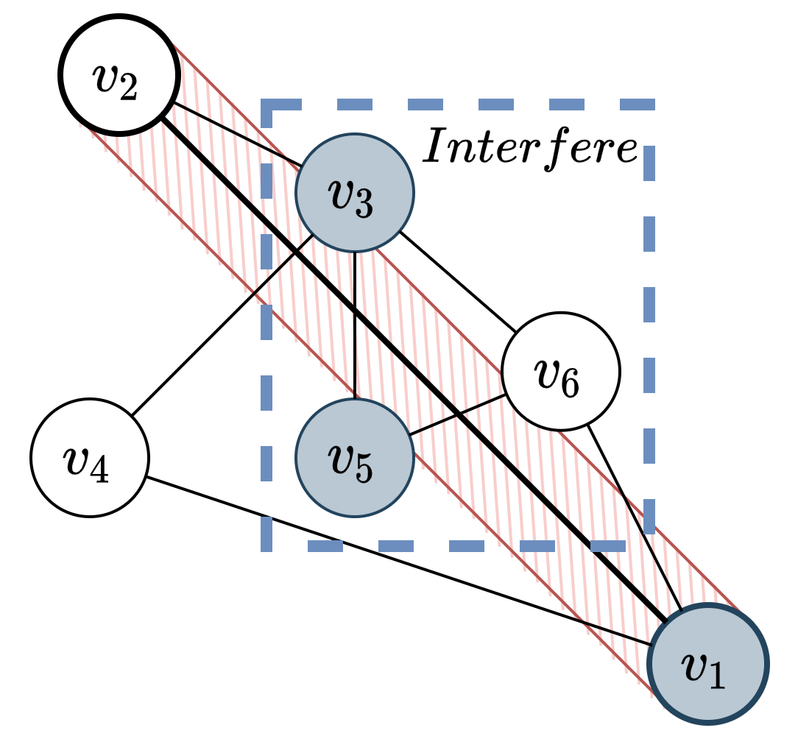

# Pebble Motion Search

Pebble motion search algorithm, which takes into account the size of the agents. Algorithm based on Push and Rotate and modifies the ```move``` procedure. Every time, when agent needs to move along edge, the new ```move-la``` procedure tries to push interfere agants away from edge.


